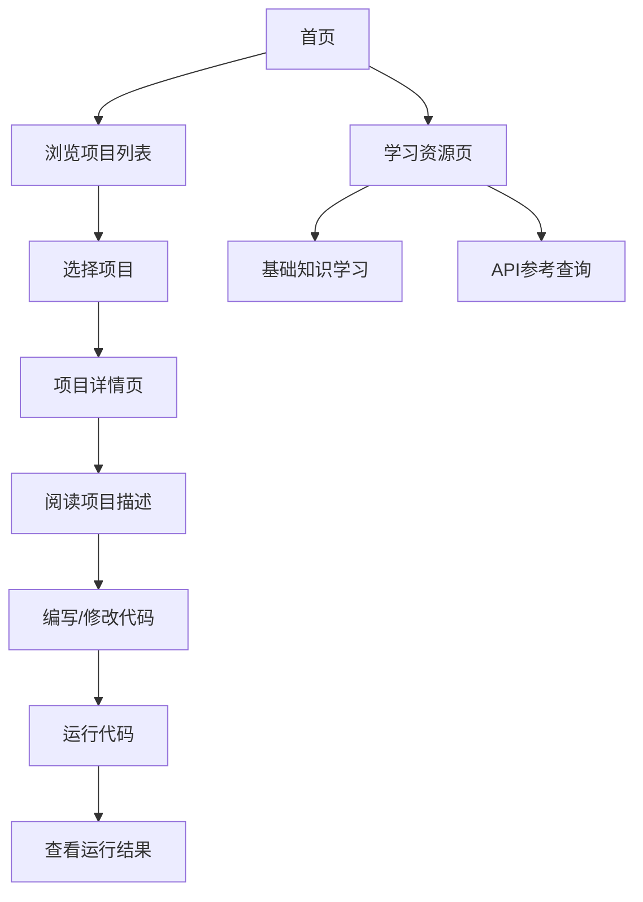

## 1. Product Overview
Pandas数据分析训练项目是一个完全在浏览器中运行的交互式学习平台，帮助用户从零开始掌握数据分析核心技能。
- 提供10个精选实战项目，从入门到进阶，覆盖数据分析的核心概念和技术。
- 目标用户为数据科学初学者、学生和希望提升数据分析能力的专业人士。

## 2. Core Features

### 2.1 User Roles
| Role | Registration Method | Core Permissions |
|------|---------------------|------------------|
| Guest User | No registration required | Access all training projects and run code in browser |

### 2.2 Feature Module
1. **首页**: 项目介绍、课程导航、项目列表
2. **项目详情页**: 项目描述、代码编辑器、运行结果展示
3. **学习资源页**: 数据分析基础知识、pandas API参考

### 2.3 Page Details
| Page Name | Module Name | Feature description |
|-----------|-------------|---------------------|
| 首页 | 项目介绍 | 平台概述、学习路径说明、核心功能介绍 |
| 首页 | 课程导航 | 按难度级别分类的项目列表，从入门到进阶 |
| 首页 | 项目列表 | 10个精选实战项目的卡片式展示，包含项目名称、难度和简介 |
| 项目详情页 | 项目描述 | 详细的项目说明、学习目标、数据集介绍 |
| 项目详情页 | 代码编辑器 | 交互式代码编辑器，支持Python代码编写和执行 |
| 项目详情页 | 运行结果展示 | 实时展示代码执行结果，包括数据表格、图表和分析结论 |
| 学习资源页 | 基础知识 | 数据分析基本概念、pandas库使用指南 |
| 学习资源页 | API参考 | 常用pandas函数和方法的详细说明 |

## 3. Core Process
用户访问平台后，可以浏览首页的项目列表，选择感兴趣的项目进入详情页。在详情页中，用户可以阅读项目描述，查看示例代码，修改并运行代码，实时查看执行结果。用户还可以通过学习资源页获取数据分析的基础知识和pandas API参考。

## 4. User Interface Design
### 4.1 Design Style
- 主色调: 蓝色 (#1E88E5) 和白色 (#FFFFFF)
- 辅助色: 浅灰 (#F5F5F5)、深灰 (#424242)、绿色 (#4CAF50)
- 按钮样式: 圆角矩形，悬浮效果
- 字体: 无衬线字体，主标题18px，副标题16px，正文14px
- 布局风格: 卡片式布局，响应式设计
- 图标风格: 简约现代，使用线性图标

### 4.2 Page Design Overview
| Page Name | Module Name | UI Elements |
|-----------|-------------|-------------|
| 首页 | 项目介绍 | 大型hero区域，包含平台名称、标语和简短描述，使用渐变背景 |
| 首页 | 课程导航 | 水平标签栏，按难度级别分类（入门、中级、高级） |
| 首页 | 项目列表 | 网格布局的卡片，每个卡片包含项目名称、难度标签、简短描述和开始按钮 |
| 项目详情页 | 项目描述 | 顶部标题区域，包含项目名称和难度标签，下方是详细描述和学习目标 |
| 项目详情页 | 代码编辑器 | 左侧代码编辑区域，支持语法高亮和代码提示 |
| 项目详情页 | 运行结果展示 | 右侧结果展示区域，包含数据表格、图表和文本输出 |
| 学习资源页 | 基础知识 | 章节式布局，包含标题、内容和代码示例 |
| 学习资源页 | API参考 | 搜索框和分类列表，支持按功能分类浏览API |

### 4.3 Responsiveness
- 设计采用桌面优先原则，同时支持平板和移动设备
- 在小屏幕设备上，代码编辑器和运行结果展示区域将垂直堆叠
- 导航栏在移动设备上折叠为汉堡菜单
- 项目卡片在不同屏幕尺寸下自动调整布局

### 4.4 3D Scene Guidance
- 不适用，本项目为纯数据分析学习平台，无需3D场景