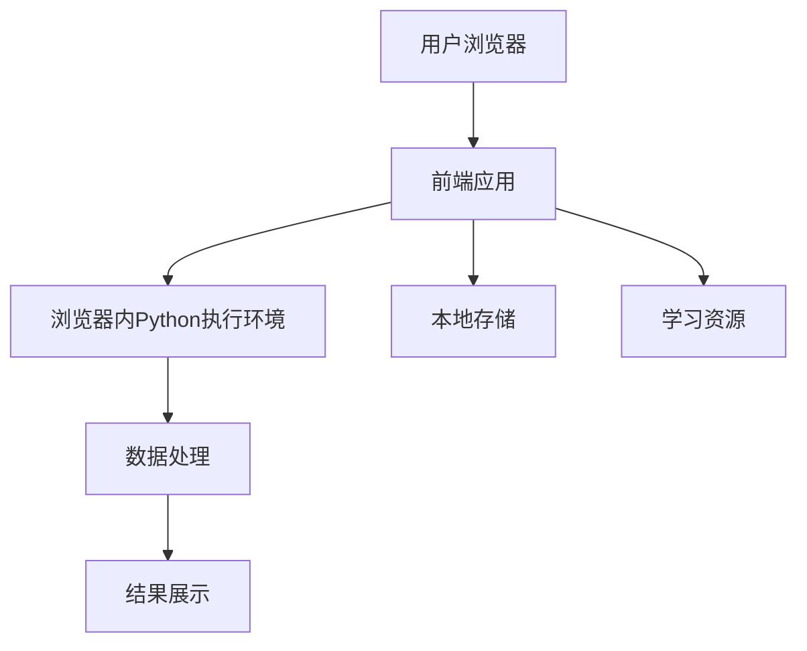
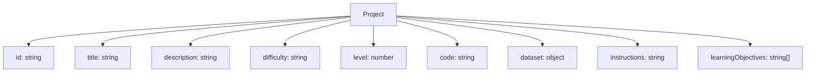

## 1. Architecture Design

## 2. Technology Description
- 前端: React@18 + TypeScript + Tailwind CSS@3 + Vite
- 初始化工具: Vite
- 后端: 无（完全在浏览器中运行）
- 数据库: 无（使用内存数据和本地存储）
- Python执行环境: Pyodide（在浏览器中运行Python）
- 数据可视化: Plotly.js
- 代码编辑器: Monaco Editor

## 3. Route Definitions
| Route | Purpose |
|-------|---------|
| / | 首页，展示项目列表 |
| /project/:id | 项目详情页，包含代码编辑器和运行结果 |
| /resources | 学习资源页，包含基础知识和API参考 |

## 4. API Definitions
- 无后端API，所有功能均在浏览器中实现

## 5. Server Architecture Diagram
- 不适用，本项目完全在浏览器中运行

## 6. Data Model
### 6.1 Data Model Definition

### 6.2 Data Definition Language
- 不适用，本项目使用内存数据和本地存储，无需数据库DDL语句

## 7. 项目列表
1. **入门级**
   - 项目1: 数据读取与基本操作
   - 项目2: 数据清洗与预处理
   - 项目3: 数据统计与描述性分析

2. **中级**
   - 项目4: 数据分组与聚合
   - 项目5: 数据合并与连接
   - 项目6: 时间序列分析
   - 项目7: 数据可视化基础

3. **高级**
   - 项目8: 复杂数据处理与转换
   - 项目9: 高级数据可视化
   - 项目10: 综合数据分析项目